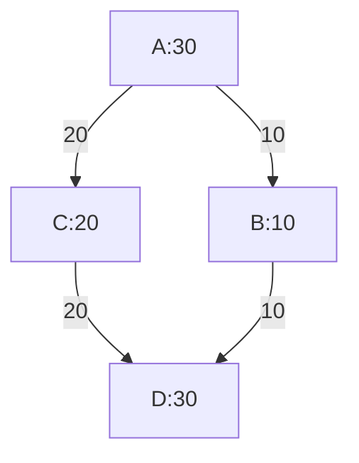
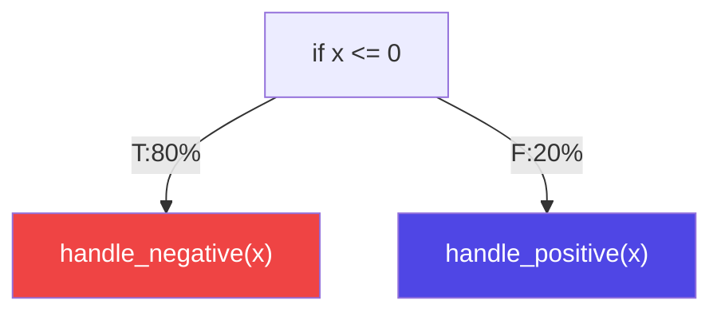

<style>
.footnotes {
  margin-top: 50px;
  font-size: 0.55em;
}

.footnotes-sep {
  display: none;
}

.footnotes ol {
  line-height: 1;
}

.footnotes li,
.footnotes p {
  margin: 0;
}
</style>


## Spotting Accuracy Issues in Profile-Guided Optimization 
A new methodology to spot metadata propagation errors within optimization pipelines

<div class="flex items-center" style="gap:50px">
<span>
Supervisor<br>
Prof. Daniele Cono D'Elia
</span>
<span>
Co-supervisor<br>
Dr. Cristian Assaiante
</span>
</div>

<div class="absolute bottom-0 right-0">
    
</div>

---
hideInToc: true
---
# Table of Contents
<Toc maxDepth=1 />

---
layout: figure-side
figureUrl: "/images/dev.svg"
---

# Compilers 

<v-clicks every="1">

- What is a compiler?  
  - Translates high-level code into machine/executable code  
  - Bridges human code and CPU instructions  
- Optimization  
  - Improves speed and memory usage  
  - Removes inefficiencies (e.g., dead code, inlining, simplifications)  

</v-clicks>

---
layout: figure-side
figureUrl: "/images/compiler_structure.svg"
---

# Compilers Architecture

<v-clicks>

- Compiler Structure 
    - Front-end -> From source code to IR
    - Middle-end -> Optimizes IR
    - Back-end -> Generates target code
- Intermediate Representation (IR)
    - Manipulated by the middle end
    - Designed to simplify optimizations
    - Multiple types exists

</v-clicks>

---

# Optimizations

- The optimization process
    - A sequence of transformations (a.k.a. Pipeline)
    - The IR is processed at each pass 
    - Output is a *better* program w.r.t. some performance metrics.
    - Supported by static analysis that <span v-mark="{at:1, color: 'red', type: 'underline'}">estimate</span> control-flow

<br>
<br>
<br>
<div align="flex flex-col items-center"> 
    
</div>

<!-- 
- Static analysis relies on conservative heuristics 
- Pipelines result of a lot of experimentations by developers
-->

---

# Profile Guided Optimization

<div class="absolute right-100px bottom-90px">



</div>

<v-clicks every="1">

- A smart optimization technique
    - Leverages *control flow information* captured at runtime to steer optimizations
    - Notable performance improvement 
- Control flow information (or *profile*) a.k.a. 
    - Weights on control flow edges
    - Counts on basic blocks
- Profiles can be captured via:
    - Instrumentation -> Additional logic inside the program
    - Sampling -> CPU counters + Perf
    - Tracing -> Profile aggregated from the program trace 

</v-clicks>

---
layout: image
image: "/images/pgo/pgo1.svg"
backgroundSize: 80%
transition: fade
---

## <span class="text-black">PGO Workflow</span>

---
layout: image
image: "/images/pgo/pgo2.svg"
backgroundSize: 80%
transition: fade
---

## <span class="text-black">PGO Workflow</span>

---
layout: image
image: "/images/pgo/pgo3.svg"
backgroundSize: 80%
transition: fade
---

## <span class="text-black">PGO Workflow</span>

---
layout: image
image: "/images/pgo/pgo4.svg"
backgroundSize: 80%
transition: fade
---

## <span class="text-black">PGO Workflow</span>

---
layout: image
image: "/images/pgo/pgo5.svg"
backgroundSize: 80%
transition: fade
---

## <span class="text-black">PGO Workflow</span>

---
layout: image
image: "/images/pgo/pgo6.svg"
backgroundSize: 80%
transition: fade
---

## <span class="text-black">PGO Workflow</span>

---
layout: image
image: "/images/pgo/pgo7.svg"
backgroundSize: 80%
---

## <span class="text-black">PGO Workflow</span>

---

# Profile Inaccuracy Sources
- Profiles needs to accurately reflect actual runtime control flow
- Profile inaccuracies can stem from various sources
    - Sampling techniques needs to be rectified 
    - Stale profile collected on older version of a program 
    - Profile propagation throughout the pipeline needs to be accurate
- Previous works tackled this three main inaccuracies sources
    - Rectification problem: Rectification algorithm following flow conservation rules [^profi]
    - Staleness problem: Structural matching and inference algorithm [^stale]
    - Profile Propagation: Study on scale of the problem [^propagation]

[^profi]: Wenlei He, Julián Mestre, Sergey Pupyrev, Lei Wang, and Hongtao Yu. “Profile inference revisited”.
[^stale]: Amir Ayupov, Maksim Panchenko, and Sergey Pupyrev. “Stale Profile Matching”.
[^propagation]: Youfeng Wu. “Accuracy of Profile Maintenance in Optimizing Compilers”.

---

# Profile Information Propagation 

- The starting profile is propagated throughout the entire pipeline
    - Each optimization is responsible for the update of the profile information
    - Additional logic to handle profile metadata in passes source code

<div class="p-20px" align=center>
    
</div>

- Bugs in such a logic reduce the efficacy of PGO
    - Even a single wrong propagation can trigger a cascading effect
    - Subsequent pass will work on wrong profile information!

<div style="display:flex; background:#f5775b; margin-top:25px; padding:10px; border-radius:4px; justify-content:center;" v-click>
No previous work provides a way to spot such bugs within complex optimization pipelines
</div>

---

# Toy Example 
<div style="display:flex; flex-direction:row; justify-content:space-evenly; align-items:center; height:80%;">

<div style="display:flex; flex-direction:column; justify-content:space-evenly; align-items:center;">

```c{all}
// Before pass
if (x > 0) { // Then branch taken 80 times
    handle_positive(x) 🔥
} else { // Else branch taken 20 times
    handle_negative(x) ❄️
}
```


</div>


<div v-click style="display:flex; flex-direction:column; justify-content:space-evenly; align-items:center;" >

```c{all}
// After pass
if (x <= 0) { // Then branch taken 80 times
    handle_negative(x) 🔥
} else { // Else branch taken 20 times
    handle_positive(x) ❄️
}
```



</div>
</div>

---

# Security Implications

<v-clicks>

- Compilers are a critical components of software development 
    - Their correctness impacts both correctness *and security* of software
- Profile-Guided Optimization influences critical low-level decisions
    - Code layout (hot vs cold blocks)
    - Branch prediction hints
    - Inlining and execution hot paths
- Security-relevant consequences
    - Timing side-channel amplification due to unexpected control-flow behavior[^side]
    - Breaking assumptions used in constant-time or hardened code
 
<div style="display:flex; background:#f5775b; margin-top:25px; padding:10px; border-radius:4px; justify-content:center;">
 Optimization correctness is not only a performance concern, but also a security dependency!
</div>

</v-clicks>

[^side]: Thomas Allan, Billy Bob Brumley, Katrina Falkner, Joop van de Pol, and Yuval Yarom. “Amplifying side channels through performance degradation”

---

# Proposed Methodology 

- Novel methodology to spot profile propagation bugs
- Organized in two main phases
    - Optimization phase: Spots profile mismatches introduce by a full pipeline
    - Search phase: Attributes faulty pass for each found mismatch 

<br>
<div align="flex flex-col items-center"> 
    
</div>
---
layout: image
image: "/images/opt/opt1.svg"
backgroundSize: 90%
transition: fade
---

## <span class="text-black">Optimization Phase</span>

---
layout: image
image: "/images/opt/opt2.svg"
backgroundSize: 90%
transition: fade
---

## <span class="text-black">Optimization Phase</span>

---
layout: image
image: "/images/opt/opt3.svg"
backgroundSize: 90%
transition: fade
---

## <span class="text-black">Optimization Phase</span>

---
layout: image
image: "/images/opt/opt5.svg"
backgroundSize: 90%
transition: fade
---

## <span class="text-black">Optimization Phase</span>

---
layout: image
image: "/images/opt/opt6.svg"
backgroundSize: 90%
transition: fade
---

## <span class="text-black">Optimization Phase</span>

---
layout: image
image: "/images/opt/opt7.svg"
backgroundSize: 90%
transition: fade
---

## <span class="text-black">Optimization Phase</span>

---
layout: image
image: "/images/opt/opt8.svg"
backgroundSize: 90%
transition: fade
---

## <span class="text-black">Optimization Phase</span>

---
layout: image
image: "/images/opt/opt9.svg"
backgroundSize: 90%
transition: fade
---

## <span class="text-black">Optimization Phase</span>

---
layout: image
image: "/images/opt/opt10.svg"
backgroundSize: 90%
transition: fade
---

## <span class="text-black">Optimization Phase</span>

---
layout: image
image: "/images/opt/opt11.svg"
backgroundSize: 90%
transition: fade
---

## <span class="text-black">Optimization Phase</span>

---
layout: image
image: "/images/opt/opt12.svg"
backgroundSize: 90%
transition: fade
---

## <span class="text-black">Optimization Phase</span>

---
layout: image
image: "/images/opt/opt13.svg"
backgroundSize: 90%
transition: fade
---

## <span class="text-black">Optimization Phase</span>

---
layout: image
image: "/images/opt/opt14.svg"
backgroundSize: 90%
transition: fade
---

## <span class="text-black">Optimization Phase</span>

---
layout: image
image: "/images/opt/opt15.svg"
backgroundSize: 90%
transition: fade
---

## <span class="text-black">Optimization Phase</span>

---
layout: figure-side
figureUrl: "/images/report.png"
---

## Search Phase

- Phase to perform fault attribution
    - Each found mismatch is attributed to the pass that caused it
    - This helps to pinpoint the cause of a profile propagation error
    - Based on a binary search on the optimization pipeline
- The output is a JSON report containing all the mismatches found with fault information
---

# Evaluation 

- Eight major testing campaigns were launched varying on
    - Optimization pipelines tested
    - Program generations parameters
    - Globally disabled passes
- Evaluation performed on the LLVM compiler infrastructure 
    - Open source and inclined to research

<div align=center v-click>
    
</div>


---

# Results

- Eleven total issues were found and reported to the LLVM community
    - One was an hard to spot integer overflow!
    - (2 more reported a couple of days ago)

<br>
<div align=center v-click>
    
</div>

---

# Summary 


- A new methodology introduced 
    - Based on the comparison with a ground-truth profile 
    - Detects profile propagation errors systematically

<v-clicks>

- Framework implemented and evaluated 
    - Validation performed on LLVM compiler infrastructure
    - Large testing campaigns to stress test the compiler
- Real bugs discovered
    - Confirms the validity of the proposed methodology

</v-clicks>

<div class="absolute bottom-30px right-20px">
    
</div>

---

# Future works
<v-clicks>

- From an evaluation perspective 
    - Evaluate the framework with real world applications
    - Evaluate how discovered and fixed bugs affect performance in generated binaries
    - Evaluate how randomly generated programs impacts the codebase coverage in LLVM
- Test the framework on other compiler infrastructure
    - Need to change only the framework back-end 
    - Analysis scripts remain virtually the same
- Improving the tracking of basic block  
    - To enhance the accuracy of fault attribution 

</v-clicks>

---
layout: center 
hideInToc: true
---

# Thank you for your attention
