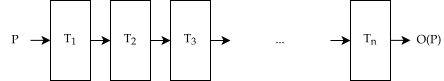

## Profile Information Propagation Analysis
A new methodology to spot metadata propagation errors within optimization pipelines

<div class="flex items-center" style="gap:50px">
<span>
Supervisor<br>
Prof. Daniele Cono D'Elia
</span>
<span>
Co-supervisor<br>
PhD. Cristian Assaiante
</span>
</div>

<div class="absolute bottom-0 right-0">
    
</div>

---
layout: table-of-contents
hideInToc: true
---
# Table of Contents

---
layout: figure-side
figureUrl: "./static/compiler_structure.svg"
---

# Compilers 

- What is a compiler?
    - Translates source code -> target code
    - Preserves program semantic
    - *Optimizes* code during translation

<v-clicks every="1">

- Compiler Structure (3 Stages)
    - Front-end -> Parses source code -> builds IR
    - Middle-end -> Optimizes IR
    - Back-end -> Generates target code
- Intermediate Representation (IR)
    - Multiple IR types exist
    - Choice depends on compiler design goals

</v-clicks>

---

# Optimizations

- The optimization process
    - A sequence of transformations (a.k.a. Pipeline)
    - The IR is processed at each pass 
    - Output is a *better* program w.r.t. some performance metrics.
    - Supported by static or dynamic analysis that <span v-mark="{at:1, color: 'red', type: 'underline'}">estimate</span> control-flow

<br>
<br>
<br>
<div align="flex flex-col items-center"> 
    
</div>

---

# Profile Guided Optimization

<v-clicks every="1">

- A smart optimization technique
    - Leverages *control flow information* captured at runtime to steer optimizations
    - Notable performance improvement 
- Control flow information (or *profile*) a.k.a. 
    - Weights on control flow edges
    - Counts on basic blocks
- Profiles can be captured via:
    - Instrumentation -> Additional logic inside the program
    - Sampling -> CPU counters + Perf
    - Tracing -> Profile aggregated from the program trace 

</v-clicks>

---
layout: image
image: "./static/pgo.svg"
backgroundSize: 80%
---
## <span class="text-black">PGO Workflow</span>
---
layout: figure-side
figureUrl: "./static/llvm.svg"
figureCaption: "LLVM architecture"
---

# The LLVM Project

- The LLVM Project 
    - A collection of modular and reusable compiler and toolchain technologies
    - Designed around a modern SSA-based compilation strategy 

<v-clicks depth="1">

- Key Components
    - LLVM Core -> Source- and target-independent optimizer
    - Clang -> Native C/C++ compiler for LLVM
    - LLD ->  High-performance linker

</v-clicks>

<v-click>

...and many more!

</v-click>

---

# Profile Guided Optimization in LLVM 

- Profile information encoded as instruction metadata
    - `branch_weights` -> Counts associated to instructions that change the control flow 
    ```llvm {all|4,5}
    bb41:                                             ; preds = %bb37
      store i32 0, ptr %i40, align 4
      %i42 = load <4 x i32>, ptr @h, align 16
      br i1 %i39, label %.split.us.preheader, label %.split.preheader, !prof !30
    !30 = !{!"branch_weights", i32 2000, i32 1000}
    ```
    - `function_entry_counts` -> Number of times a function was called
    ```llvm {all|4}
    define i32 @foo() !prof !1 {
      ret i32 0
    }
    !1 = !{!"function_entry_count", i64 2590}
    ```
    - `vp` -> Profiles data values passed to functions (Not treated)

---

## Profile Analysis

- Profile information used to compute aggregated control flow information

<div class="flex items-center" style="gap:10px;height:100%;padding-bottom:60px">
    <v-clicks>
    <div class="flex" style="justify-content:center;border:2px solid black;border-radius:5px;width:300px; height:90%">
    BranchProbabilityInfo
    </div>
    <div class="flex" style="justify-content:center;border: 2px solid black; width:300px;border-radius:5px; height:90%">
    BlockFrequencyInfo
    </div>
    <div class="flex" style="justify-content:center;border: 2px solid black; width:300px;border-radius:5px; height:90%">
    ProfileSummaryInfo
    </div>
    </v-clicks>
</div>

---

# Problem Formulation

---

# Proposed Methodology

