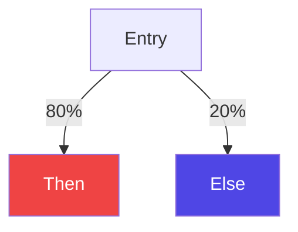
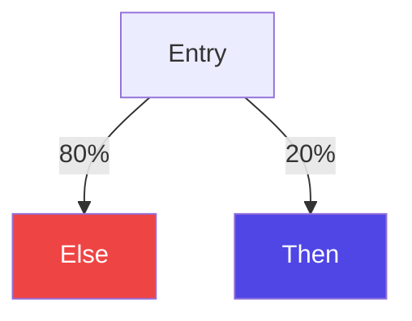

## Spotting Accuracy Issues in Profile-Guided Optimization 
A new methodology to spot metadata propagation errors within optimization pipelines

<div class="flex items-center" style="gap:50px">
<span>
Supervisor<br>
Prof. Daniele Cono D'Elia
</span>
<span>
Co-supervisor<br>
Dr. Cristian Assaiante
</span>
</div>

<div class="absolute bottom-0 right-0">
    
</div>

---
hideInToc: true
---
# Table of Contents
<Toc maxDepth=1 />

---
layout: figure-side
figureUrl: "/images/compiler_structure.svg"
---

# Compilers 

<v-clicks every="1">

- What is a compiler?
    - Translates source code -> target code
    - Preserves program semantic
    - *Optimizes* code during translation
- Compiler Structure (3 Stages)
    - Front-end -> Parses source code -> builds IR
    - Middle-end -> Optimizes IR
    - Back-end -> Generates target code
- Intermediate Representation (IR)
    - Multiple IR types exist
    - Depends on compiler design goals

</v-clicks>

---

# Optimizations

- The optimization process
    - A sequence of transformations (a.k.a. Pipeline)
    - The IR is processed at each pass 
    - Output is a *better* program w.r.t. some performance metrics.
    - Supported by static or dynamic analysis that <span v-mark="{at:1, color: 'red', type: 'underline'}">estimate</span> control-flow

<br>
<br>
<br>
<div align="flex flex-col items-center"> 
    
</div>

---

# Profile Guided Optimization

<v-clicks every="1">

- A smart optimization technique
    - Leverages *control flow information* captured at runtime to steer optimizations
    - Notable performance improvement 
- Control flow information (or *profile*) a.k.a. 
    - Weights on control flow edges
    - Counts on basic blocks
- Profiles can be captured via:
    - Instrumentation -> Additional logic inside the program
    - Sampling -> CPU counters + Perf
    - Tracing -> Profile aggregated from the program trace 

</v-clicks>

---
layout: image
image: "/images/pgo.svg"
backgroundSize: 80%
---

## <span class="text-black">PGO Workflow</span>

---

# Profile Guided Optimization in LLVM 

- Profile information encoded as instruction metadata
    - `branch_weights` -> Counts associated to instructions that change the control flow 
    ```llvm {all|4,5}
    bb41:
      store i32 0, ptr %i40, align 4
      %i42 = load <4 x i32>, ptr @h, align 16
      br i1 %i39, label %.split.us.preheader, label %.split.preheader, !prof !30
    !30 = !{!"branch_weights", i32 2000, i32 1000}
    ```
    - `function_entry_counts` -> Number of times a function was called
    ```llvm {all|4}
    define i32 @foo() !prof !1 {
      ret i32 0
    }
    !1 = !{!"function_entry_count", i64 2590}
    ```

---

# Profile Accuracy
<style>
.footnotes {
  margin-top: 50px;
  font-size: 0.55em;
}

.footnotes-sep {
  display: none;
}

.footnotes ol {
  line-height: 1;
}

.footnotes li,
.footnotes p {
  margin: 0;
}
</style>
- Profile accuracy is vital for a successful profile-guided optimization application
- Profile inaccuracies can stem from various sources
    - Sampling techniques needs to be rectified 
    - Stale profile collected on older version of a program 
    - Profile propagation throughout the pipeline needs to be accurate
- Previous works tackled this three main inaccuracies sources
    - Rectification problem [^profi]
    - Staleness problem [^stale]
    - Profile Propagation [^propagation]

[^profi]: Wenlei He, Julián Mestre, Sergey Pupyrev, Lei Wang, and Hongtao Yu. “Profile inference revisited”.
[^stale]: Amir Ayupov, Maksim Panchenko, and Sergey Pupyrev. “Stale Profile Matching”.
[^propagation]: Youfeng Wu. “Accuracy of Profile Maintenance in Optimizing Compilers”.
---

# Profile Information Propagation 

- The starting profile is propagated throughout the entire pipeline
    - Each LLVM optimization is responsible for the update of the profile information
    - Additional logic to handle profile metadata in passes source code

<div class="p-20px" align=center>
    
</div>

- Bugs in such a logic reduce the efficacy of PGO
    - Subsequent pass will work on wrong profile information
    - A cascading effect will trigger
    - Bad optimization decisions can be taken!

---

# Toy Example 
<div style="display:flex; flex-direction:row; justify-content:space-evenly; align-items:center;">

<div style="display:flex; flex-direction:column; justify-content:space-evenly; align-items:center;">

```llvm{all|3,4|6,7|9,10|12}
% Before dummy pass
entry:
  %cmp = icmp sgt i32 %x, 0
  br i1 %cmp, label %then, label %else, !prof !0

then: 🔥
    call i32 @handle_positive_x(i32 %x)

else: ❄️
    call i32 @handle_negative_x(i32 %x)

!0 = !{!"branch_weights", i32 80, i32 20}
```

<v-clicks>



</v-clicks>

</div>

<div style="display:flex; flex-direction:column; justify-content:space-evenly; align-items:center;" >

```llvm{all|3,4|6,7|9,10|12}
% After dummy pass
entry:
  %cmp = icmp sle i32 %x, 0
  br i1 %cmp, label %else, label %then, !prof !0

then: ❄️
    call i32 @handle_positive_x(i32 %x)

else: 🔥
    call i32 @handle_negative_x(i32 %x)

!0 = !{!"branch_weights", i32 80, i32 20}
```

<v-clicks>



</v-clicks>

</div>
</div>

---

# Security Implications

<v-clicks>

- Compilers are a critical components of software development 
    - Their correctness impacts both correctness *and security* of software
- Profile-Guided Optimization influences critical low-level decisions
    - Code layout (hot vs cold blocks)
    - Branch prediction hints
    - Inlining and execution hot paths
- Security-relevant consequences
    - Timing side-channel amplification due to unexpected control-flow behavior
    - Breaking assumptions used in constant-time or hardened code
- Optimization correctness is not only a performance concern, but also a security dependency!

</v-clicks>

---
layout: image
image: "/images/opt_phase.svg"
backgroundSize: 60%
---

# <span class="text-black">Optimization Phase</span>

---
layout: image
image: "/images/search.svg"
backgroundSize: 60%
---

# <span class="text-black">Search Phase</span>

---

# Results

<v-clicks> 

- Eight major fuzzing campaigns were launched varying on
    - Optimization pipelines tested
    - Program generations parameters
    - Globally disabled passes
- Eleven total issues were found and reported to the LLVM community

</v-clicks>

<div align=center v-click>

</div>

---

# Summary 
<v-clicks>

- A new methodology introduced 
    - Based on the comparison with a ground-truth profile 
    - Detects profile propagation errors systematically
- Framework implemented and evaluated 
    - Validation performed through large fuzzing campaigns
- Real bugs discovered
    - Confirms the validity of the proposed methodology

</v-clicks>

---

# Future works
<v-clicks>

- From an evaluation perspective 
    - Evaluate the framework with real world applications
    - Evaluate how discovered and fixed bugs affect performance in generated binaries
    - Evaluate how randomly generated programs impacts the codebase coverage in LLVM
- Test the framework on other compiler infrastructure
    - Need to change only the framework back-end 
    - Analysis scripts remain virtually the same
- Improving the tracking of basic block  
    - To enhance the accuracy of fault attribution 

</v-clicks>

---
layout: center 
hideInToc: true
---

# Thank you for your attention
