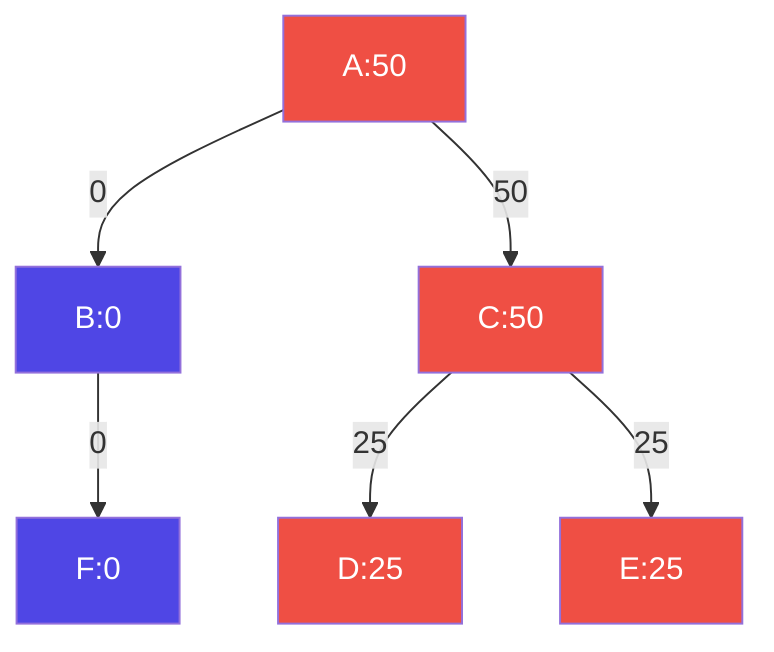
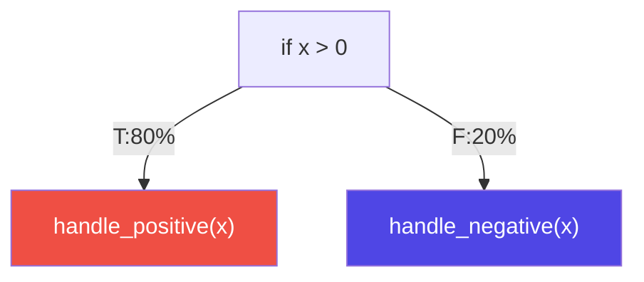

## Spotting Accuracy Issues in Profile-Guided Optimization 
A new methodology to spot metadata propagation errors within optimization pipelines

<div class="flex items-center" style="gap:50px">
<span>
Supervisor<br>
Prof. Daniele Cono D'Elia
</span>
<span>
Co-supervisor<br>
Dr. Cristian Assaiante
</span>
</div>

<div class="absolute bottom-0 right-0">
    
</div>

---
hideInToc: true
---

# Table of Contents

<Toc maxDepth=1 />

---
layout: figure-side
figureUrl: "/images/dev.svg"
---

# Compilers 

<v-clicks>

- What is a compiler?  
  - Translates high-level code into machine/executable code  
  - Bridges human code and CPU instructions  
- Optimizations
  - Improves speed and memory usage
  - Removes inefficiencies (e.g., dead code, inlining, simplifications)
   
</v-clicks>

---
hideInToc: true
---

# Compilers Architecture

<v-clicks depth=2>

- Compiler Structure
    - Front-end -> From source code to IR
    - Middle-end -> Optimizes IR
    - Back-end -> Generates target code

</v-clicks>

<v-clicks>

- Intermediate Representation (IR)
    - Internal code representation
    - Designed to be conducive to further processing 
    - Independent of any source or target language
    - Supports metadata for optimization, debugging etc...

</v-clicks>

<div class="absolute right-0px top-40px">

<div v-show="$clicks === 2" >
    
</div>
<div v-show="$clicks === 3" >
    
</div>
<div v-show="$clicks === 4" >
    
</div>
<div v-show="$clicks > 4" >
    
</div>

</div>

<!--
- Metadata are attached to instructions 
-->

---
hideInToc: true
---

# Optimizations

- The optimization process
    - A sequence of transformations (a.k.a. Pipeline)
    - The IR is processed at each pass 
    - Output is a *better* program w.r.t. some performance metrics.
    - Supported by static analysis that <span v-mark="{at:1, color: 'red', type: 'underline'}">estimate</span> control-flow

<br>
<br>
<br>
<div align="flex flex-col items-center"> 
    
</div>

<!-- 
- Pipelines are a result of a lot of experimentations performed by compiler developers
- Static analysis relies on conservative heuristics but also precise control-flow or data-flow analysis
-->

---

# Profile Guided Optimization

<div v-show="$clicks >= 2" class="absolute right-0px bottom-90px">



</div>

<v-clicks every="1">

- A smart optimization technique
    - Leverages *control flow information* captured at runtime to steer optimizations
    - Notable performance improvement 
- Control flow information (or *profile*) a.k.a. 
    - Weights on control flow edges
    - Counts on basic blocks
- Profiles can be captured via:
    - <span v-mark="{at:3, color: 'red', type: 'underline'}">Instrumentation</span> -> Additional logic inside the program
    - Sampling -> CPU counters + Perf
    - Tracing -> Profile aggregated from the program trace 

</v-clicks>

<!--
- With control flow information we refer to information that tell us what region of the program were executed and how frequently
-->

---
hideInToc: true
---

# Profile Information

<v-clicks every="1">

- Instrumentation can happen at different stages
    - Source-level instrumentation 
    - <span v-mark="{at:0, color: 'red', type: 'underline'}">IR-level instrumentation</span>
- Profile Information is persisted in a binary format
    - The content depends on the technique used to capture profile
    - Multiple runs generate multiple files 
    - Hierarchical structure that keeps track how many times instrumented blocks were hit

```
Counters:
  main:
    Instrumentation Points: 4
    Counts: [100, 0, 0, 100]
Instrumentation level: IR 
Functions shown: 1
Total functions: 1
Total number of instrumentation points: 4
Total count: 200
```

</v-clicks>

---
hideInToc: true
---

# PGO Workflow

<div style="display:flex; justify-content:center; align-items:center; height:100%">

<v-clicks>

<div v-show="$clicks === 1" >
    
</div>
<div v-show="$clicks === 2">
    
</div>
<div v-show="$clicks === 3">
    
</div>
<div v-show="$clicks === 4">
    
</div>
<div v-show="$clicks === 5">
    
</div>
<div v-show="$clicks === 6">
    
</div>
<div v-show="$clicks === 7">
    
</div>

</v-clicks>

</div>

---
hideInToc: true
---

# Profile Inaccuracy Sources

- Profiles needs to accurately reflect actual runtime control flow

<v-clicks depth=2>

- Profile inaccuracies can stem from various sources
    - Sampling techniques needs to be rectified 
    - Stale profile collected on older version of a program 
    - Profile propagation throughout the pipeline needs to be accurate

</v-clicks>

<div align=center> 

<div v-show="$clicks < 2">
    
</div>

<div v-show="$clicks === 2">
    
</div>
<div v-show="$clicks === 3">
    
</div>
<div v-show="$clicks === 4">
    
</div>

</div>

--- 

# State of the Art 

- Previous works tackled this three main inaccuracies sources
    - Rectification problem: Rectification algorithm following flow conservation rules [^profi]
    - Staleness problem: Structural matching and inference algorithm [^stale]
    - Profile Propagation: Study on scale of the problem [^propagation]

[^profi]: Wenlei He, Julián Mestre, Sergey Pupyrev, Lei Wang, and Hongtao Yu. “Profile inference revisited”.
[^stale]: Amir Ayupov, Maksim Panchenko, and Sergey Pupyrev. “Stale Profile Matching”.
[^propagation]: Youfeng Wu. “Accuracy of Profile Maintenance in Optimizing Compilers”.

---

# Profile Information Propagation 

- The starting profile is propagated throughout the entire PGO pipeline
    - Each optimization is responsible for the update of the profile information
    - Additional logic to handle profile metadata in passes source code

<div class="p-20px" align=center>
    
</div>

- Bugs in such a logic reduce the efficacy of PGO
    - Even a single wrong propagation can trigger a cascading effect
    - Subsequent pass will work on wrong profile information!

<div style="display:flex; background:#f5775b; margin-top:25px; padding:10px; border-radius:4px; justify-content:center;" v-click>
No previous work provides a way to spot such bugs within complex optimization pipelines
</div>

---
hideInToc: true
---

# Toy Example 
<div style="display:flex; flex-direction:row; justify-content:space-evenly; align-items:center; height:80%;">

<div style="display:flex; flex-direction:column; justify-content:space-evenly; align-items:center;">

```c{all}
// Before pass
if (x > 0) { // Then branch taken 80 times
    handle_positive(x) 🔥
} else { // Else branch taken 20 times
    handle_negative(x) ❄️
}
```



</div>

<div v-click style="display:flex; flex-direction:column; justify-content:space-evenly; align-items:center;" >

```c{all}
// After pass
if (x <= 0) { // Then branch taken 80 times
    handle_negative(x) 🔥
} else { // Else branch taken 20 times
    handle_positive(x) ❄️
}
```


</div>
</div>

---
hideInToc: true
---

# Security Implications

<v-clicks>

- Compilers are a critical components of software development 
    - Their correctness impacts both correctness *and security* of software
- Profile-Guided Optimization influences critical low-level decisions
    - Code layout (hot vs cold blocks)
    - Branch prediction hints
    - Inlining and execution hot paths
- Security-relevant consequences
    - Timing side-channel amplification due to unexpected control-flow behavior[^side]
    - Breaking assumptions used in constant-time or hardened code

</v-clicks>

<div v-click style="display:flex; background:#f5775b; margin-top:25px; padding:10px; border-radius:4px; justify-content:center;">
 Optimization correctness is not only a performance concern, but also a security dependency!
</div>

[^side]: Thomas Allan, Billy Bob Brumley, Katrina Falkner, Joop van de Pol, and Yuval Yarom. “Amplifying side channels through performance degradation”

---

# Proposed Solution 

- Novel methodology to spot profile propagation bugs
- Organized in two main phases
    - Optimization phase: Spots profile mismatches introduce by a full pipeline
    - Search phase: Attributes faulty pass for each found mismatch 

<br>
<br>
<br>
<br>
<div align="flex flex-col items-center"> 
    
</div>

---
hideInToc: true
---

# Optimization Phase 

<div style="display:flex; justify-content:center; align-items:center; height:90%">

<v-clicks>

<div v-show="$clicks === 1">
    
</div>
<div v-show="$clicks === 2">
    
</div>
<div v-show="$clicks === 3">
    
</div>
<div v-show="$clicks === 4">
    
</div>
<div v-show="$clicks === 5">
    
</div>
<div v-show="$clicks === 6">
    
</div>
<div v-show="$clicks === 7">
    
</div>
<div v-show="$clicks === 8">
    
</div>
<div v-show="$clicks === 9">
    
</div>

</v-clicks>

</div>

---
layout: figure-side
figureUrl: "/images/report.png"
hideInToc: true
---

# Search Phase

- Phase to perform fault attribution
    - Each found mismatch is attributed to the pass that caused it
    - This helps to pinpoint the cause of a profile propagation error
    - Based on a binary search on the optimization pipeline
- The output is a JSON report containing all the mismatches found with fault information

---

# Evaluation 

- Eight major testing campaigns were launched varying on
    - Optimization pipelines tested
    - Program generations parameters
    - Globally disabled passes
- Evaluation performed on the LLVM compiler infrastructure 
    - Open source and inclined to research

<div align=center>
    
</div>

---
hideInToc: true
---

# Results

- Eleven total issues were found and reported to the LLVM community *
    - One was an hard to spot integer overflow!

<br>
<div align=center>
    
</div>

<br>
<br>
<br>

\* 2 more reported a couple of days ago

---

# Conclusions

- A new methodology introduced 
    - Based on the comparison with a ground-truth profile 
    - Detects profile propagation errors systematically

<v-clicks>

- Framework implemented and evaluated 
    - Validation performed on LLVM compiler infrastructure
    - Large testing campaigns to stress test the compiler
- Real bugs discovered
    - Confirms the validity of the proposed methodology

</v-clicks>

<div class="absolute bottom-30px right-20px">
    
</div>

---

# Future works
<v-clicks>

- From an evaluation perspective 
    - Evaluate the framework with real world applications
    - Evaluate how discovered and fixed bugs affect performance in generated binaries
    - Evaluate how randomly generated programs[^csmith] impacts the codebase coverage in LLVM
- Test the framework on other compiler infrastructure
    - Need to change only the framework back-end 
    - Analysis scripts remain virtually the same
- Improving the tracking of basic block  
    - To enhance the accuracy of fault attribution 

</v-clicks>

[^csmith]: Xuejun Yang, Yang Chen, Eric Eide, and John Regehr. “Finding and understanding bugs in C compilers”.

---
layout: center 
hideInToc: true
---

# Thank you for your attention
